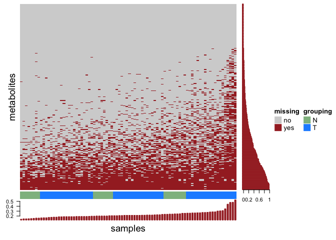
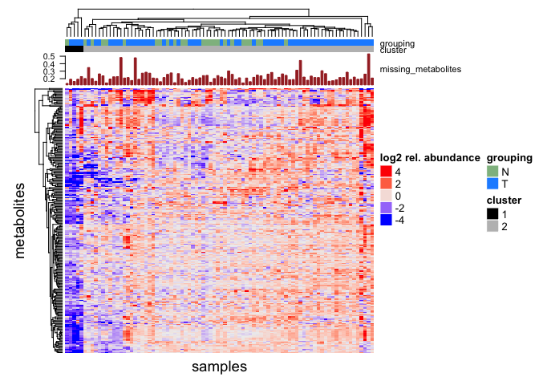
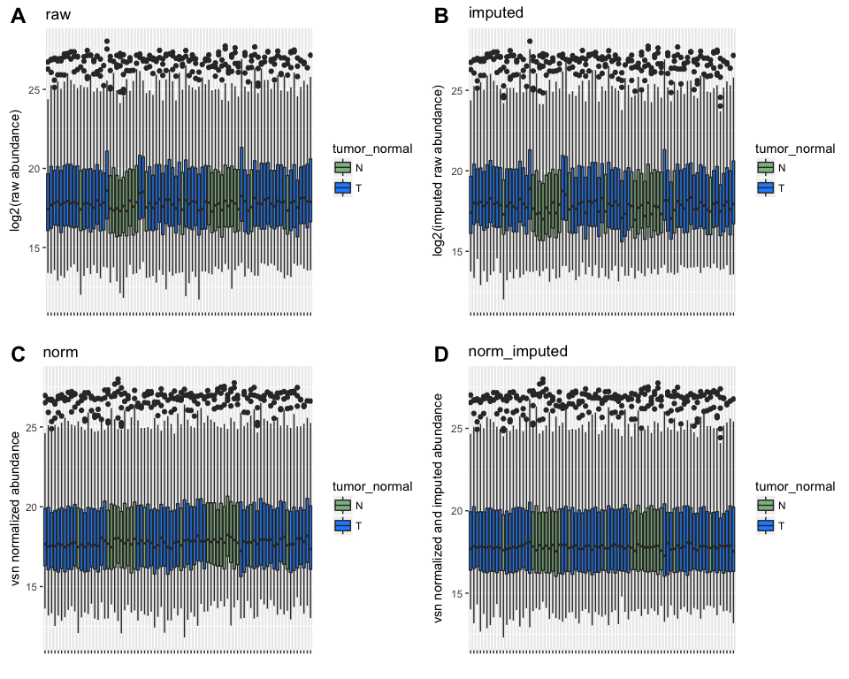
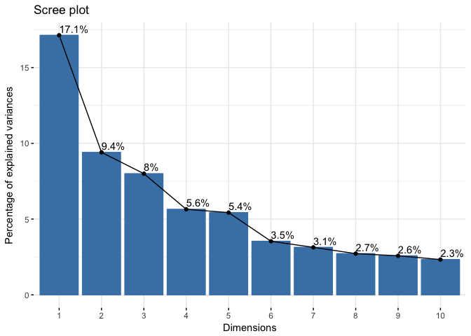
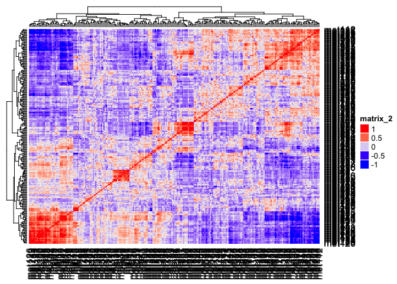
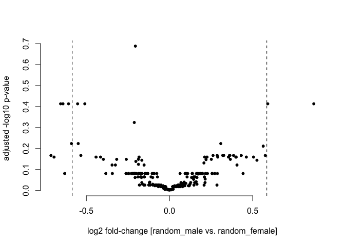
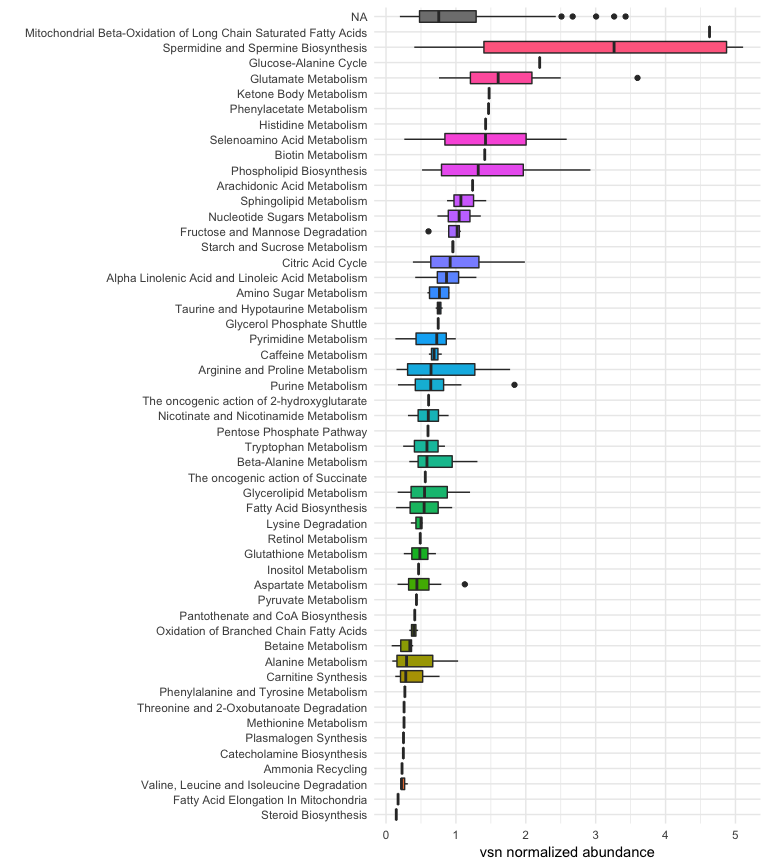
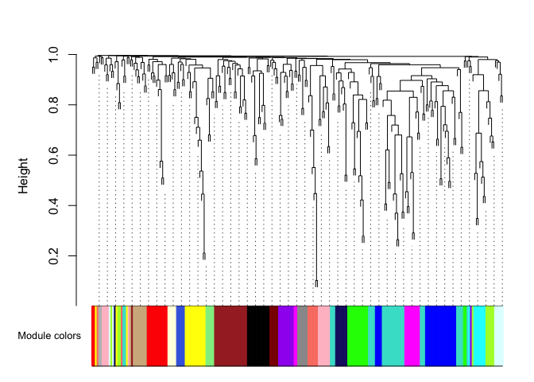
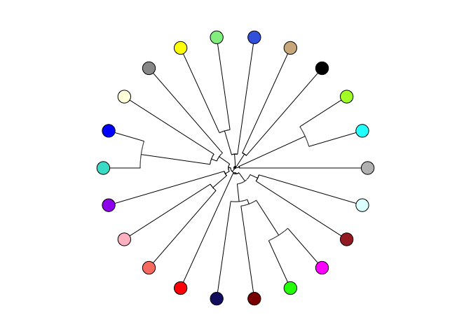

MetaboDiff tutorial
================
Andreas Mock
Experimental Neurosurgery, Heidelberg University Hospital,
Division of Applied Bioinformatics, German Cancer Research Center (DFKZ) Heidelberg &
Department of Medical Oncology, National Center for Tumor Diseases (NCT) Heidelberg
2017-07-21

-   [Introduction](#introduction)
-   [Installation](#installation)
    -   [Install dependencies](#install-dependencies)
    -   [Install MetaboDiff](#install-metabodiff)
-   [Part I: Data processing](#part-i-data-processing)
    -   [Reading data and annotation](#reading-data-and-annotation)
    -   [Imputation of missing values](#imputation-of-missing-values)
    -   [Removal of outliers](#removal-of-outliers)
    -   [Normalization](#normalization)
    -   [Summary of processed object](#summary-of-processed-object)
    -   [Quality control of normalization](#quality-control-of-normalization)
-   [Part II: Data analysis](#part-ii-data-analysis)
    -   [Principal component analysis (PCA)](#principal-component-analysis-pca)
    -   [Hypothesis testing](#hypothesis-testing)
    -   [Pathway analysis](#pathway-analysis)
    -   [Metabolic correlation network analysis](#metabolic-correlation-network-analysis)
-   [Session information](#session-information)
-   [References](#references)

Introduction
============

Comparative non-targeted metabolomics comes of age through an increasing number of commercial vendors offering reproducible high-quality metabolomic data for translational researchers outside the mass spectrometry field. This R packages aims to provide a low-level entry to differential metabolomic analysis by starting off with the table of relative metabolite quantifications provided by commercial vendors or core facilities.

Installation
============

The `MetaboDiff` R package can be installed via Github. Please note that `MetaboDiff` requires an R version &gt;= 3.4.

Install dependencies
--------------------

Please note that CRAN occasionally fails to compile the `WGCNA` package for Mac OS X. Hence, we recommend to install the package before installing `MetaboDiff`:

``` r
install.packages("WGCNA")
```

If asked, install the package from source. Please refer to the [developer page](https://labs.genetics.ucla.edu/horvath/CoexpressionNetwork/Rpackages/WGCNA/)
if you encounter problems installing the `WGCNA` package.

Install MetaboDiff
------------------

``` r
library("devtools")
install_github("andreasmock/MetaboDiff")
```

and once installed loaded by

``` r
library("MetaboDiff")
```

Part I: Data processing
=======================

Reading data and annotation
---------------------------

### Example data

The example data is derived from a study by Priolo and colleagues in which they used the service of Metabolon® to compare the tissue metabolome of 40 prostate cancers with 16 normal prostate specimens [1]. The table summarizing the relative metabolic measurements can be loaded from the journal homepage as follows:

``` r
data = as.matrix(gdata::read.xls("http://cancerres.aacrjournals.org/highwire/filestream/290852/field_highwire_adjunct_files/4/131853_1_supp_2658512_nbpsn6.xlsx",
                          sheet=5,
                          na.strings = ""))
```

### Input files

The metabolomic data within `MetaboDiff` is stored as a `MultiAssayExperiment`class [2]. This framework enables the coordinated representation of multiple experiments on partially overlapping samples with associated metadata and integrated subsetting across experiments. In the context of metabolomic data analysis, multiple assays are needed to store raw data and imputed data which usually contain different number of metabolites due to missing values (see section on data imputation for more details).

The core components of the `MultiAssayExperiment` class are:

-   `ExperimentList` - a slot of class ExperimentList containing data for each experimental assay. Within the ExperimentList slot, the metabolomic data are stored as
    SummarizedExperiment objects consisting of:
    -   `assay` - a matrix containing the relative metabolic measurements.
    -   `rowData` - a dataframe containing the metabolite annotation..
-   `colData` - a slot of class data frame describing the sample metadata available across all experiments
-   `sampleMap` - a slot of class data frame relating clinical data to experimental assay
-   `metadata` - a slot of class list. Within MetaboDiff, this slot contains a list of dataframes summarizing the results from the hypothesis testing.

#### Creation of assay object containing metabolomic data

``` r
assay = apply(data[3:nrow(data),8:ncol(data)],2,as.numeric)
colnames(assay) = paste0(rep("sample",ncol(assay)),1:ncol(assay))
rownames(assay) = paste0(rep("met",nrow(assay)),1:nrow(assay))
assay[1:4,1:5]
```

    ##       sample1   sample2   sample3 sample4   sample5
    ## met1 33964.73 117318.43 118856.90 78670.7 102565.94
    ## met2 18505.56 167585.32  59621.97 66220.4  74892.27
    ## met3       NA  42373.93  27141.21      NA  38390.78
    ## met4 61638.77  74595.78        NA      NA        NA

#### Creation of colData object containing sample metadata

``` r
colData = data.frame(id = colnames(t(data[1,8:ncol(data)])),
                     tumor_normal = as.vector(t(data[1,8:ncol(data)])),
                   row.names=paste0(rep("pat",ncol(assay)),1:ncol(assay)))
```

To showcase the full functionality of `MetaboDiff`, we generate a second random group label "random\_gender".

``` r
#set seed for reproducibility 
set.seed(1)

colData$random_gender = sample(c("random_male","random_female"),size = nrow(colData),replace = TRUE)
head(colData)
```

    ##        id tumor_normal random_gender
    ## pat1  cp2            N   random_male
    ## pat2  cp7            N   random_male
    ## pat3 cp19            N random_female
    ## pat4 cp26            N random_female
    ## pat5 cp29            N   random_male
    ## pat6 cp32            N random_female

#### Creation of rowData object containing metabolite annotations and ids

For the rowData object we start off with the annotation already provided by the commercial vendor:

``` r
rowData = as.data.frame(data[3:nrow(data),1:7])
colnames(rowData) = data[2,1:7]
colnames(rowData)[7] = "HMDB_ID"
rownames(rowData) = paste0(rep("met",nrow(assay)),1:nrow(assay))
colnames(rowData)
```

    ## [1] "BIOCHEMICAL"   "SUPER_PATHWAY" "SUB_PATHWAY"   "METABOLON_ID" 
    ## [5] "PLATFORM"      "KEGG_ID"       "HMDB_ID"

#### Annotation using Small Molecular Pathway Database (SMPDB)

Alongside the metabolic measurements, Metabolon® provides metabolite annotation including so called super-pathways and sub-pathways. However, theses annotations might very from vendor to vendor. Hence, the `MetaboDiff` package makes use of the Small Molecular Pathway Database (SMPDB) for metabolite annotation [3]. `MetaboDiff` supports all common metabolic IDs as input for the annotation (HMDB, KEGG and ChEBI). In the example data, both the KEGG and the HMDB identifier are available. As the databases (HMDB, KEGG or ChEBI) cover unique annotations due to different standards in identifying and reporting metabolites [4], the function `get_SMPDBanno` queries the database using all three ids (if available) and joins all available information. The current SMPDB build used within `MetaboDiff` is version 2.0 and will be updated as new versions are released. Please refer to the development branch of `MetaboDiff` to work with the latest SMPDB annotation.

``` r
rowData = get_SMPDBanno(rowData,
                        column_kegg_id=6,
                        column_hmdb_id=7,
                        column_chebi_id=NA)
```

### Creation of SummarizedExperiment object and ExperimentList

``` r
se = SummarizedExperiment(assays=assay,
                           rowData=rowData)
experiment_list = list(raw=se)
experiment_list
```

    ## $raw
    ## class: SummarizedExperiment 
    ## dim: 307 86 
    ## metadata(0):
    ## assays(1): ''
    ## rownames(307): met1 met2 ... met306 met307
    ## rowData names(22): BIOCHEMICAL SUPER_PATHWAY ... SMPDB|InChI
    ##   SMPDB|InChI.Key
    ## colnames(86): sample1 sample2 ... sample85 sample86
    ## colData names(0):

### Creation of sampleMap

``` r
sampleMap = data.frame(primary=rownames(colData),
                 colname=colnames(se))
sampleMap_list = listToMap(list(raw=sampleMap))
```

### Construction of MultiAssayExperiment

``` r
met = MultiAssayExperiment(experiments = experiment_list,
                           colData = colData,
                           sampleMap = sampleMap_list)
met
```

    ## A MultiAssayExperiment object of 1 listed
    ##  experiment with a user-defined name and respective class. 
    ##  Containing an ExperimentList class object of length 1: 
    ##  [1] raw: SummarizedExperiment with 307 rows and 86 columns 
    ## Features: 
    ##  experiments() - obtain the ExperimentList instance 
    ##  colData() - the primary/phenotype DataFrame 
    ##  sampleMap() - the sample availability DataFrame 
    ##  `$`, `[`, `[[` - extract colData columns, subset, or experiment 
    ##  *Format() - convert ExperimentList into a long or wide DataFrame 
    ##  assays() - convert ExperimentList to a SimpleList of matrices

Imputation of missing values
----------------------------

In contrast to other high-throughput technologies, missing values are common in quantitative metabolomic datasets.

The function `na_heatmap` visualizes the missing metabolite measurements across the samples. The name of the column in colData for grouping and the label colors for the two groups need to be specified.

``` r
na_heatmap(met,
           group_factor="tumor_normal",
           label_colors=c("darkseagreen","dodgerblue"))
```



The example data supports the need for data imputation. It could be shown that k-nearest neighbor imputation minimizes the effects on the normality and variance of the data as long as the number of missing data does not exceed 40% [5].

The function 'knn\_impute' adds the slot "impute" to the MultiAssayExperiment object that contains the imputed relative metabolite measurements for all metabolites with raw measurements in more than 60% of cases. We recommend a cutoff of 40% (i.e. 0.4). However the cutoff might be changed according to the discretion of the user.

``` r
met = knn_impute(met,cutoff=0.4)
met
```

    ## A MultiAssayExperiment object of 2 listed
    ##  experiments with user-defined names and respective classes. 
    ##  Containing an ExperimentList class object of length 2: 
    ##  [1] raw: SummarizedExperiment with 307 rows and 86 columns 
    ##  [2] imputed: SummarizedExperiment with 238 rows and 86 columns 
    ## Features: 
    ##  experiments() - obtain the ExperimentList instance 
    ##  colData() - the primary/phenotype DataFrame 
    ##  sampleMap() - the sample availability DataFrame 
    ##  `$`, `[`, `[[` - extract colData columns, subset, or experiment 
    ##  *Format() - convert ExperimentList into a long or wide DataFrame 
    ##  assays() - convert ExperimentList to a SimpleList of matrices

As apparent form the summary description of the object 'met' the imputed data matrix contains only 238 of the 307 original metabolites according the cutoff of 40% missing values.

Removal of outliers
-------------------

Before we normalize the data, we want to exclude outliers in the study set. To this end, we provide the function `outlier_heatmap`. The sample annotation shows the number of missing metabolites per sample as the proxy of the impact of imputation on clustering. To showcase outliers, the hierarchical clustering tree is cut in 2 clusters.

``` r
outlier_heatmap(met,
                group_factor="tumor_normal",
                label_colors=c("darkseagreen","dodgerblue"))
```



The imputed data of the example study set displays a cluster of 5 samples (cluster 1) with an in average lower relative metabolite abundance. Due to the lack of batch information, this cannot be investigted further at this time. To demonstrate, how a cluster can be removed, we apply the function `remove_cluster` to remove cluster 1:

``` r
met = remove_cluster(met,cluster=1)
met
```

    ## A MultiAssayExperiment object of 2 listed
    ##  experiments with user-defined names and respective classes. 
    ##  Containing an ExperimentList class object of length 2: 
    ##  [1] raw: SummarizedExperiment with 307 rows and 81 columns 
    ##  [2] imputed: SummarizedExperiment with 238 rows and 81 columns 
    ## Features: 
    ##  experiments() - obtain the ExperimentList instance 
    ##  colData() - the primary/phenotype DataFrame 
    ##  sampleMap() - the sample availability DataFrame 
    ##  `$`, `[`, `[[` - extract colData columns, subset, or experiment 
    ##  *Format() - convert ExperimentList into a long or wide DataFrame 
    ##  assays() - convert ExperimentList to a SimpleList of matrices

As displayed in the summary of the `met` object, the 5 samples of cluster 1 were successfully removed from the slots "raw" and "imputed".

Normalization
-------------

Variance stabilizing normalization (vsn) is used ensure that the variance remains nearly constant over the measured spectrum (Huber et al., 2002).

``` r
met = normalize_met(met)
```

    ## vsn2: 307 x 81 matrix (1 stratum).

    ## Please use 'meanSdPlot' to verify the fit.

    ## vsn2: 238 x 81 matrix (1 stratum).

    ## Please use 'meanSdPlot' to verify the fit.

Summary of processed object
---------------------------

``` r
met
```

    ## A MultiAssayExperiment object of 4 listed
    ##  experiments with user-defined names and respective classes. 
    ##  Containing an ExperimentList class object of length 4: 
    ##  [1] raw: SummarizedExperiment with 307 rows and 81 columns 
    ##  [2] imputed: SummarizedExperiment with 238 rows and 81 columns 
    ##  [3] norm: SummarizedExperiment with 307 rows and 81 columns 
    ##  [4] norm_imputed: SummarizedExperiment with 238 rows and 81 columns 
    ## Features: 
    ##  experiments() - obtain the ExperimentList instance 
    ##  colData() - the primary/phenotype DataFrame 
    ##  sampleMap() - the sample availability DataFrame 
    ##  `$`, `[`, `[[` - extract colData columns, subset, or experiment 
    ##  *Format() - convert ExperimentList into a long or wide DataFrame 
    ##  assays() - convert ExperimentList to a SimpleList of matrices

At this point the data processing is completed. The `MultiAssayExperiment` object contains now 4 slots:

-   raw - raw relative metabolic measurements as provided by company or core facility
-   imputed - imputed relative metabolic measurements (k-nearest neighbor imputation)
-   norm - normalized relative metabolic measurements (vsn)
-   norm\_imputed - normalized imputed relative metabolic measurements (vsn)

Quality control of normalization
--------------------------------

``` r
quality_plot(met,
             group_factor="tumor_normal",
             label_colors=c("darkseagreen","dodgerblue"))
```



Part II: Data analysis
======================

Principal component analysis (PCA)
----------------------------------

``` r
metadata(met)$res_pca = FactoMineR::PCA(t(assays(met)[["norm_imputed"]]), 
              scale.unit = TRUE,
              graph=FALSE)
```

Visualize percentage of explained variances for the first ten principal components i.e. dimensions.

``` r
factoextra::fviz_screeplot(metadata(met)$res_pca , addlabels=TRUE)
```



PCA plot.

``` r
factoextra::fviz_pca_ind(metadata(met)$res_pca,
             label="none",
             habillage=colData(met)[["tumor_normal"]],
             palette=c("darkseagreen","dodgerblue"),
             addEllipses = TRUE)
```



Hypothesis testing
------------------

Differential analysis for individual metabolites is performed using Student's T-Test. Correction for multiple testing is performed by independent hypothesis weighting (IHW [6]) with variance as a covariate.

Hypothesis testing will be performed for the sample grouping "tumor\_normal", as well for the randomly generated grouping "random\_gender".

``` r
met = diff_test(met,
                group_factors = c("tumor_normal","random_gender"))
```

The results of the hypothesis testing is saved in the `metadata` splot of the MultiAssayExperiment object.

``` r
str(metadata(met), max.level=2)
```

    ## List of 2
    ##  $ ttest_tumor_normal :'data.frame': 238 obs. of  4 variables:
    ##   ..$ pval       : num [1:238] 0.0206 0.7808 0.0832 0.0432 0.5859 ...
    ##   ..$ adj_pval   : num [1:238] 0.18 0.911 0.219 0.158 0.716 ...
    ##   ..$ fold_change: num [1:238] 0.2872 0.0366 -0.3936 -0.5391 -0.1646 ...
    ##   ..$ var        : num [1:238] 0.264 0.287 0.872 1.21 1.516 ...
    ##  $ ttest_random_gender:'data.frame': 238 obs. of  4 variables:
    ##   ..$ pval       : num [1:238] 0.2318 0.8626 0.4048 0.0121 0.2111 ...
    ##   ..$ adj_pval   : num [1:238] 0.83 0.959 0.862 0.386 0.83 ...
    ##   ..$ fold_change: num [1:238] 0.1372 0.0208 -0.1742 -0.607 -0.3438 ...
    ##   ..$ var        : num [1:238] 0.264 0.287 0.872 1.21 1.516 ...

The columns of the result data frame are the unadjusted p-value (pval), the adjusted p-value by independent hypothesis weighting (adj\_pval), the Fold-Change between groups (fold\_change) and the variance (var).

The comparative analysis is visualized by means of a volcano plot.

``` r
volcano_plot(met, 
             group_factor="tumor_normal",
             label_colors=c("darkseagreen","dodgerblue"))
```



As a sanity check, we also display the volcano plot for the random grouping "random\_gender" for which we would not expect the same number of significant metabolites.

``` r
volcano_plot(met, 
             group_factor="random_gender",
             label_colors=c("brown","orange"))
```


As expected, no metabolites was significant different between the randomly assigned grouping male vs. female after multiple testing with a cutoff of p\_adjust &lt; 0.05.

Pathway analysis
----------------

In this part of the analysis, we will exploit the Small molecular Pathway Database (SMPDB) annotation to explore metabolic pathways and perform an enrichment analysis.

The annotations from the SMPDB has the prefix "SMPDB|". The remaining annotation was provided by the commercial vendor that generated the example data (i.e. Metabolon®).

``` r
colnames(rowData(met[["norm_imputed"]]))
```

    ##  [1] "BIOCHEMICAL"           "SUPER_PATHWAY"        
    ##  [3] "SUB_PATHWAY"           "METABOLON_ID"         
    ##  [5] "PLATFORM"              "KEGG_ID"              
    ##  [7] "HMDB_ID"               "SMPDB|SMPDB.ID"       
    ##  [9] "SMPDB|Pathway.Name"    "SMPDB|Pathway.Subject"
    ## [11] "SMPDB|Metabolite.ID"   "SMPDB|Metabolite.Name"
    ## [13] "SMPDB|HMDB.ID"         "SMPDB|KEGG.ID"        
    ## [15] "SMPDB|ChEBI.ID"        "SMPDB|DrugBank.ID"    
    ## [17] "SMPDB|CAS"             "SMPDB|Formula"        
    ## [19] "SMPDB|IUPAC"           "SMPDB|SMILES"         
    ## [21] "SMPDB|InChI"           "SMPDB|InChI.Key"

``` r
variance_boxplot(met,
                 rowAnnotation = "SMPDB|Pathway.Name")
```



Metabolic correlation network analysis
--------------------------------------

This section describes the generation and analysis of metabolic correlation networks. The workflow was adapted from the weighted gene co-expression analysis (WGCNA) proposed by Langfelder and Horvarth [7].

### Construction dissiumilarity matrix

The first step in constructing a metabolic correlation network is the creation of a dissimilarity matrix. Biweight midcorrelation was used as a similiarity measure as it is more robust to outliers than the absolute correlation coefficient [8]. This choice is important, as we do not expect metabolites to be correlated in all patients.

The core concept of the so called "weighted" correlation analysis by Langfelder and Horvarth is that instead of defining a "hard" threshold (e.g. an absolute correlation coefficient &gt; 0.8) to decide whether a node as connected to another, the adjacency `a` is defined by raising the similarity `s` to a power `beta` ('soft' threshold):

*a*<sub>*i**j*</sub> = *s*<sub>*i**j*</sub><sup>*β*</sup>
 Lastly, the dissimilarity measure is defined by

*w*<sub>*i**j*</sub> = 1 − *a*<sub>*i**j*</sub>

For detailed rational of this approach, please see Zhang and Horvath[9]. For metabolic networks, we identified that a beta value of 3 was the lowest power for which the scale-free topology of the topology was met.

The function `diss_matrix` creates the dissimilarity measure for the `met` objects and saves it in the metadata slot

``` r
met = diss_matrix(met)
```

    ## 

``` r
str(metadata(met), max.level=2)
```

    ## List of 3
    ##  $ ttest_tumor_normal :'data.frame': 238 obs. of  4 variables:
    ##   ..$ pval       : num [1:238] 0.0206 0.7808 0.0832 0.0432 0.5859 ...
    ##   ..$ adj_pval   : num [1:238] 0.18 0.911 0.219 0.158 0.716 ...
    ##   ..$ fold_change: num [1:238] 0.2872 0.0366 -0.3936 -0.5391 -0.1646 ...
    ##   ..$ var        : num [1:238] 0.264 0.287 0.872 1.21 1.516 ...
    ##  $ ttest_random_gender:'data.frame': 238 obs. of  4 variables:
    ##   ..$ pval       : num [1:238] 0.2318 0.8626 0.4048 0.0121 0.2111 ...
    ##   ..$ adj_pval   : num [1:238] 0.83 0.959 0.862 0.386 0.83 ...
    ##   ..$ fold_change: num [1:238] 0.1372 0.0208 -0.1742 -0.607 -0.3438 ...
    ##   ..$ var        : num [1:238] 0.264 0.287 0.872 1.21 1.516 ...
    ##  $ diss_matrix        : num [1:238, 1:238] 0 0.964 0.999 0.999 0.996 ...
    ##   ..- attr(*, "dimnames")=List of 2

### Identification of metabolic correlation modules

To identify metabolic correlation modules, metabolites are next clustered based on the dissimilarity measure, where branches of the dendrogram correspond to modules. Ultimately, modules are detected by applying a branch cutting method. We employed the dynamic branch cut method developed by Langfelder and colleagues [10], as constant height cutoffs exhibit suboptimal performance on complicated dendrograms.

``` r
met = identify_modules(met, 
                       min_module_size=5)
```

    ##  ..cutHeight not given, setting it to 0.991  ===>  99% of the (truncated) height range in dendro.
    ##  ..done.

``` r
#plot the dendrogram and corresponding colour bars underneath
WGCNA::plotDendroAndColors(metadata(met)$tree, 
                    metadata(met)$module_colors, 
                    'Module colors', 
                    dendroLabels = FALSE, 
                    hang = 0.03,
                    addGuide = TRUE, 
                    guideHang = 0.05, main='')
```



The relation between the identified co-expression modules can be visualized by a dendrogram of their *eigengenes*. The module *eigengene* is defined as the first principal component of its expression matrix. It could be shown that the module= *eigengene* is highly correlated with the gene that has the highest intramodular connectivity[11].

``` r
par(mar=c(2,2,2,2))
ape::plot.phylo(ape::as.phylo(metadata(met)$METree),
           type = 'fan',
           show.tip.label = FALSE, 
           main='')
ape::tiplabels(frame = 'circle',
          col='black', 
          text=rep('',length(unique(metadata(met)$modules))), 
          bg = levels(as.factor(metadata(met)$module_colors)))
```



Session information
===================

``` r
sessionInfo()
```

    ## R version 3.4.0 (2017-04-21)
    ## Platform: x86_64-apple-darwin15.6.0 (64-bit)
    ## Running under: macOS Sierra 10.12.5
    ## 
    ## Matrix products: default
    ## BLAS: /System/Library/Frameworks/Accelerate.framework/Versions/A/Frameworks/vecLib.framework/Versions/A/libBLAS.dylib
    ## LAPACK: /Library/Frameworks/R.framework/Versions/3.4/Resources/lib/libRlapack.dylib
    ## 
    ## locale:
    ## [1] en_GB.UTF-8/en_GB.UTF-8/en_GB.UTF-8/C/en_GB.UTF-8/en_GB.UTF-8
    ## 
    ## attached base packages:
    ##  [1] grid      parallel  stats4    stats     graphics  grDevices utils    
    ##  [8] datasets  methods   base     
    ## 
    ## other attached packages:
    ##  [1] rmarkdown_1.6              MetaboDiff_0.1.0          
    ##  [3] ComplexHeatmap_1.14.0      SummarizedExperiment_1.6.3
    ##  [5] MultiAssayExperiment_1.2.1 venneuler_1.1-0           
    ##  [7] rJava_0.9-8                HiveR_0.2.55              
    ##  [9] dplyr_0.5.0                purrr_0.2.2.2             
    ## [11] readr_1.1.1                tidyr_0.6.3               
    ## [13] tibble_1.3.3               DelayedArray_0.2.4        
    ## [15] matrixStats_0.52.2         Biobase_2.36.2            
    ## [17] GenomicRanges_1.28.2       GenomeInfoDb_1.12.0       
    ## [19] IRanges_2.10.2             S4Vectors_0.14.3          
    ## [21] BiocGenerics_0.22.0        devtools_1.13.2           
    ## [23] ggplot2_2.2.1              ape_4.1                   
    ## [25] fastcluster_1.1.22         dynamicTreeCut_1.63-1     
    ## [27] BiocInstaller_1.26.0      
    ## 
    ## loaded via a namespace (and not attached):
    ##   [1] backports_1.1.0         circlize_0.4.0         
    ##   [3] Hmisc_4.0-3             plyr_1.8.4             
    ##   [5] lazyeval_0.2.0          shinydashboard_0.6.1   
    ##   [7] splines_3.4.0           robust_0.4-18          
    ##   [9] lpsymphony_1.4.1        digest_0.6.12          
    ##  [11] foreach_1.4.3           htmltools_0.3.6        
    ##  [13] viridis_0.4.0           GO.db_3.4.1            
    ##  [15] gdata_2.18.0            checkmate_1.8.2        
    ##  [17] magrittr_1.5            memoise_1.1.0          
    ##  [19] fit.models_0.5-14       cluster_2.0.6          
    ##  [21] doParallel_1.0.10       limma_3.32.2           
    ##  [23] annotate_1.54.0         jpeg_0.1-8             
    ##  [25] colorspace_1.3-2        rrcov_1.4-3            
    ##  [27] blob_1.1.0              ggrepel_0.6.5          
    ##  [29] RCurl_1.95-4.8          genefilter_1.58.1      
    ##  [31] impute_1.50.1           survival_2.41-3        
    ##  [33] iterators_1.0.8         gtable_0.2.0           
    ##  [35] zlibbioc_1.22.0         XVector_0.16.0         
    ##  [37] UpSetR_1.3.3            GetoptLong_0.1.6       
    ##  [39] kernlab_0.9-25          shape_1.4.2            
    ##  [41] prabclus_2.2-6          DEoptimR_1.0-8         
    ##  [43] scales_0.4.1            vsn_3.44.0             
    ##  [45] mvtnorm_1.0-6           DBI_0.7                
    ##  [47] IHW_1.4.0               Rcpp_0.12.11           
    ##  [49] htmlTable_1.9           viridisLite_0.2.0      
    ##  [51] xtable_1.8-2            flashClust_1.01-2      
    ##  [53] foreign_0.8-68          bit_1.1-12             
    ##  [55] mclust_5.3              preprocessCore_1.38.1  
    ##  [57] Formula_1.2-1           htmlwidgets_0.8        
    ##  [59] RColorBrewer_1.1-2      fpc_2.1-10             
    ##  [61] acepack_1.4.1           modeltools_0.2-21      
    ##  [63] factoextra_1.0.4        pkgconfig_2.0.1        
    ##  [65] XML_3.98-1.7            flexmix_2.3-14         
    ##  [67] nnet_7.3-12             labeling_0.3           
    ##  [69] rlang_0.1.1             reshape2_1.4.2         
    ##  [71] AnnotationDbi_1.38.1    munsell_0.4.3          
    ##  [73] tools_3.4.0             RSQLite_2.0            
    ##  [75] fdrtool_1.2.15          evaluate_0.10          
    ##  [77] stringr_1.2.0           yaml_2.1.14            
    ##  [79] knitr_1.16              bit64_0.9-7            
    ##  [81] robustbase_0.92-7       dendextend_1.5.2       
    ##  [83] nlme_3.1-131            whisker_0.3-2          
    ##  [85] mime_0.5                slam_0.1-40            
    ##  [87] leaps_3.0               compiler_3.4.0         
    ##  [89] png_0.1-7               affyio_1.46.0          
    ##  [91] pcaPP_1.9-72            stringi_1.1.5          
    ##  [93] lattice_0.20-35         trimcluster_0.1-2      
    ##  [95] Matrix_1.2-10           GlobalOptions_0.0.12   
    ##  [97] data.table_1.10.4       cowplot_0.7.0          
    ##  [99] bitops_1.0-6            httpuv_1.3.3           
    ## [101] R6_2.2.1                latticeExtra_0.6-28    
    ## [103] affy_1.54.0             gridExtra_2.2.1        
    ## [105] codetools_0.2-15        MASS_7.3-47            
    ## [107] gtools_3.5.0            assertthat_0.2.0       
    ## [109] rprojroot_1.2           rjson_0.2.15           
    ## [111] withr_1.0.2             GenomeInfoDbData_0.99.0
    ## [113] diptest_0.75-7          hms_0.3                
    ## [115] rpart_4.1-11            class_7.3-14           
    ## [117] ggpubr_0.1.4            scatterplot3d_0.3-40   
    ## [119] shiny_1.0.3             WGCNA_1.60             
    ## [121] base64enc_0.1-3         FactoMineR_1.36

References
==========

[1] Priolo, C., Pyne, S., Rose, J., Regan, E. R., Zadra, G., Photopoulos, C., et al. (2014). AKT1 and MYC Induce Distinctive Metabolic Fingerprints in Human Prostate Cancer. Cancer Research, 74(24), 7198–7204. <http://doi.org/10.1158/0008-5472.CAN-14-1490>

[2] Sig M (2017). MultiAssayExperiment: Software for the integration of multi-omics experiments in Bioconductor. R package version 1.2.1

[3] Jewison T, Su Y, Disfany FM, et al. SMPDB 2.0: Big Improvements to the Small Molecule Pathway Database Nucleic Acids Res. 2014 Jan;42(Database issue):D478-84.

[4] Thiele, I., Swainston, N., Fleming, R. M. T., Hoppe, A., Sahoo, S., Aurich, M. K., et al. (2013). A community-driven global reconstruction of human metabolism. Nature Biotechnology, 31(5), 419–425. <http://doi.org/10.1038/nbt.2488>

[5] Armitage, E. G., Godzien, J., Alonso-Herranz, V., L pez-Gonz lvez, N., & Barbas, C. (2015). Missing value imputation strategies for metabolomics data. Electrophoresis, 36(24), 3050–3060. <http://doi.org/10.1002/elps.201500352>

[6] Ignatiadis, N., Klaus, B., Zaugg, J. B., & Huber, W. (2016). Data-driven hypothesis weighting increases detection power in genome-scale multiple testing. Nature Methods, 13(7), 577–580. <http://doi.org/10.1038/nmeth.3885>

[7] Langfelder, P., & Horvath, S. (2008). WGCNA: an R package for weighted correlation network analysis. BMC Bioinformatics, 9, 559–559. <http://doi.org/10.1186/1471-2105-9-559>

[8] Zheng, C.-H., Yuan, L., Sha, W., & Sun, Z.-L. (2014). Gene differential coexpression analysis based on biweight correlation and maximum clique. BMC Bioinformatics, 15 Suppl 15(Suppl 15), S3. <http://doi.org/10.1186/1471-2105-15-S15-S3>

[9] Horvarth Paper.

[10] Horvarth Paper.

[11] Ignatiadis, N., Klaus, B., Zaugg, J. B., & Huber, W. (2016). Data-driven hypothesis weighting increases detection power in genome-scale multiple testing. Nature Methods, 13(7), 577–580. <http://doi.org/10.1038/nmeth.3885>
